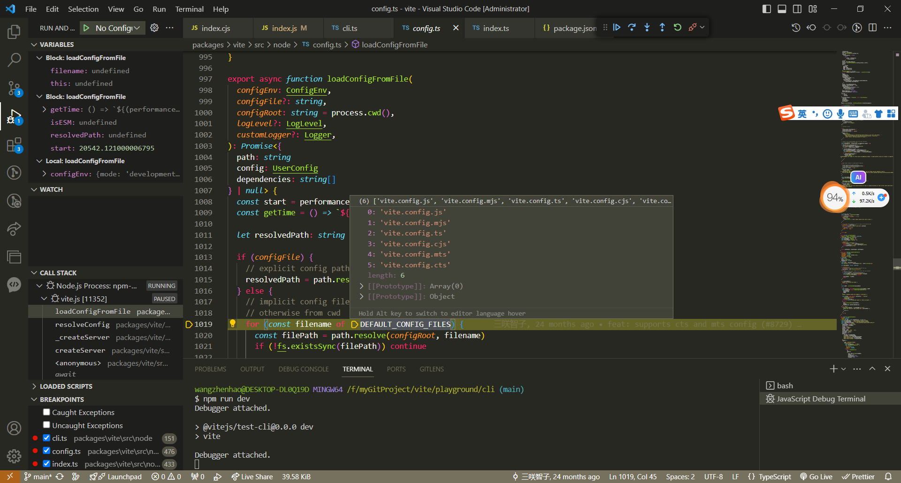

# vite

## npm run vite做了什么事情？

1. 在`packages\vite\src\node\cli.ts`, 执行cli命令

```js
cli
  .option('-c, --config <file>', `[string] use specified config file`)
  .option('--base <path>', `[string] public base path (default: /)`, {
    type: [convertBase],
  })
  .option('-l, --logLevel <level>', `[string] info | warn | error | silent`)
  .option('--clearScreen', `[boolean] allow/disable clear screen when logging`)
  .option('-d, --debug [feat]', `[string | boolean] show debug logs`)
  .option('-f, --filter <filter>', `[string] filter debug logs`)
  .option('-m, --mode <mode>', `[string] set env mode`)

```

1.1. 执行`createServer`方法，在方法会执行vite.config.js的初始化配置

而vite.cofnig.js的配置，会在`loadConfigFromFile`（packages\vite\src\node\config.ts）方法处理

<p>
  
</p>


1.1.1 最终执行`loadConfigFromBundledFile`（packages\vite\src\node\config.ts）方法，得到`userConfig`变量

1.2 js的处理中间件`transformMiddleware`(packages\vite\src\node\server\index.ts)处理
```js
middlewares.use(transformMiddleware(server))
```
