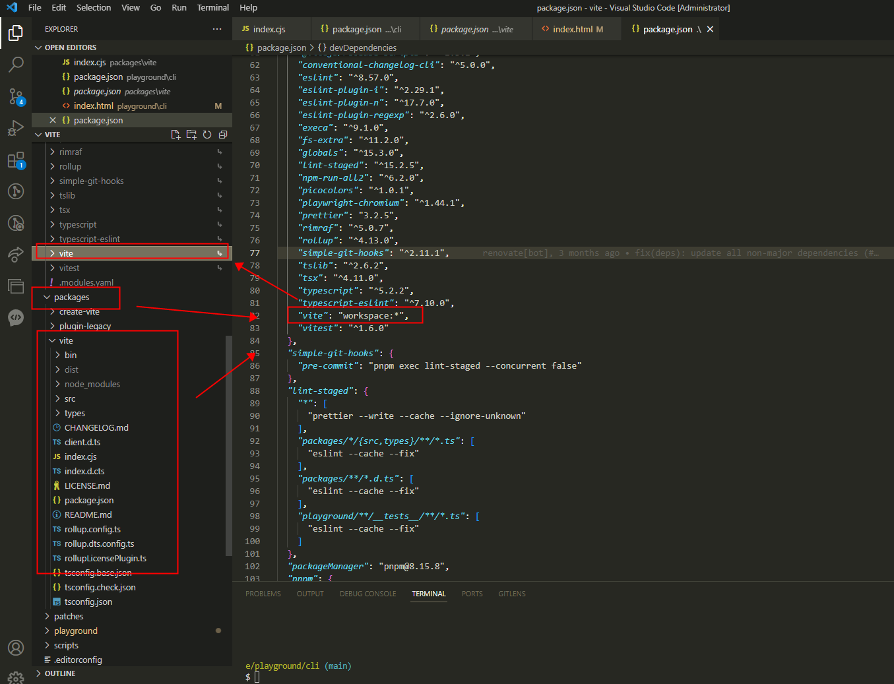
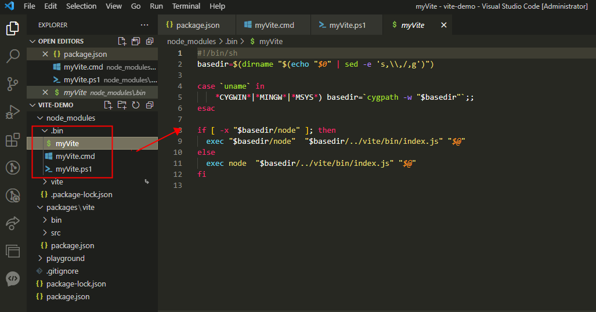

# vite 命令是如何产生的？

## 多包管理

1. 在vite的项目架构中是使用pnpm管理`workspace:*`配置

> 参考地址 https://pnpm.io/workspaces

```json
"devDependencies": {
    "vite": "workspace:*"
}
```

最终把路径是为packages/vite的文件夹作为一个npm包，执行`pnpm install`命令后，会链接到`node_modules`下
<p>
  
</p>

1.1 在npm中，可以在package.json配置`"workspaces": ["packages/vite"]`得到多包管理

> 参考地址 https://docs.npmjs.com/cli/v8/using-npm/workspaces

## 在子包的package.json中配置命令行

```json
// packages\vite\package.json
{
    "name": "vite",
    "version": "1.0.0",
    "bin": {
        "vite": "bin/vite.js"
    }
}
```
在npm包下载的时候，会在`node_modules`下生成yige`.bin`文件，里面就是可执行命令行
<p>
  
</p>
